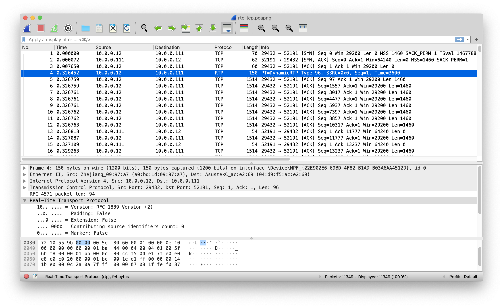
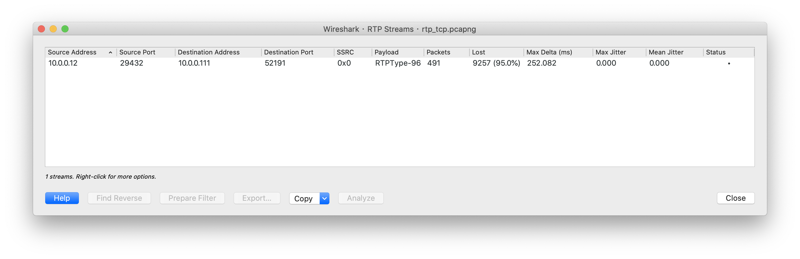
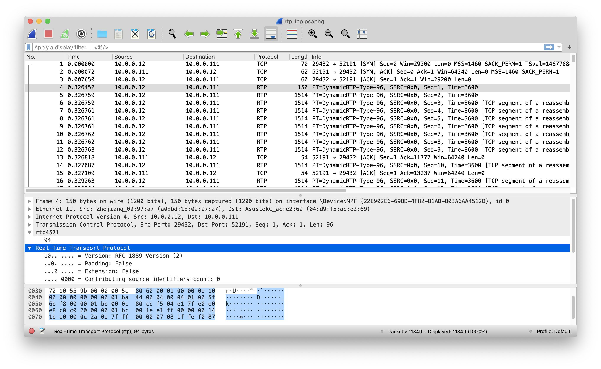
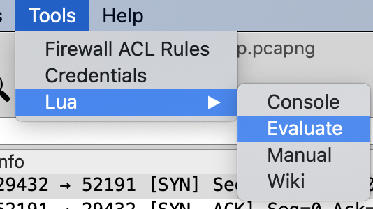

# wireshark_plugin
My plugin for wireshark

## RFC4571 plugin
Fix current dissecting problem on RTP over TCP(RFC4571)

Before use:

After:

### usage
1. Copy the content of the lua plugin.
2. Choose Tool->Lua->Evaluate, paste the content and evaluate.
3. Choose Decode As `RFC4571`

